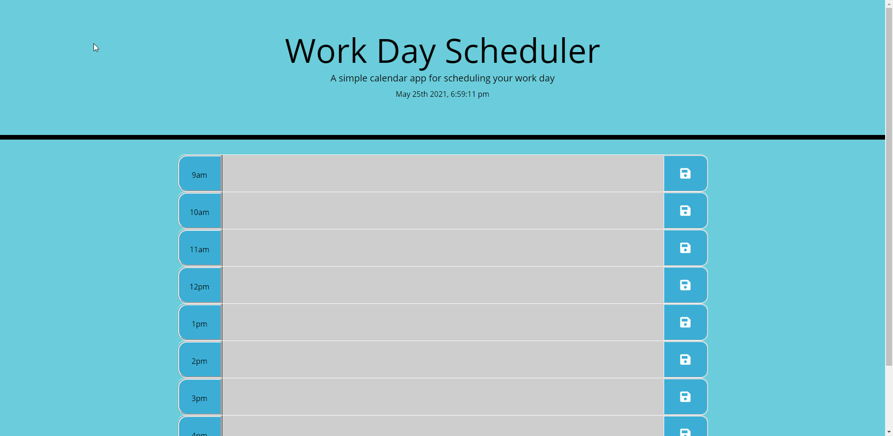

<h1 style="text-align: center;">Quiz Game</h1>

[[Deployed-Site]](https://jdogcrane.github.io/WeekdayScheduler/)

[[Site-Preview]](#Site-Preview)

## General overview: 

 
For this project the goal was to create a Work Day Scheduler with mostly java script. The Schedule allows for notes for up to nine different hours. After the user inputs data they want assigned to an hour the user will hit the save button. All data is stored locally for the user. Once the user returns to the page to the user will see all data stored accordingly. Depending on the hour of the day each section will respond accordingly with past, present and future color indicators. I even added background color to show the start and end of the day with a sort of sunset color for fun!

<h3 style="text-align:center;">Instructions</h3>

1. Create an awesome schedule to remember for a specific hours.
2. Once complete press the blue save icon on the right hand side of the section you have entered
3. Return to the page and you will have your notes managed and saved for you locally!
4. Enjoy!

<h3 style="text-align:center;">JS-Summary</h3>

* Added time and date to header
* Added function that sets styling based on what state the section is in
* Added save to local storage based off key that is assigned to that specific save button
* Added loop for each block based off length of the array
* Added added getItem to each section when the page loads
* Added sunrise and sunset/first hour and last hour background color change for more fun

>Notes: I struggled to compact my code at first. I feel this is about as good as I can get it now. I know getItem could be in a loop, but I have not figured out how I would do that so im going to move on.

## Site Preview
